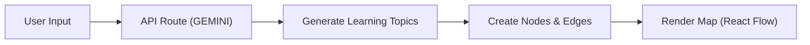

# Cerebra — AI-Powered Learning Map Generator

> *Personalized AI-driven learning maps for developers and learners, built with Next.js, TypeScript, and GitHub Copilot.*

Cerebra helps learners generate structured, interactive learning roadmaps for any topic — complete with difficulty levels, recommended resources, and a beautiful, dynamic UI.

---

## Features

- AI-Powered Learning Paths — Generates topic-based roadmaps using the GEMINI API
- Modern UI/UX — Smooth animations and gradient aesthetics with Tailwind CSS
- Interactive Maps — Explore node-based roadmaps with React Flow
- Difficulty Filters — Categorized nodes for beginner, intermediate, and advanced levels
- Auto Layout — Intelligent node positioning for better visualization
- Export Functionality — Save your generated maps as JSON files
- Custom Hooks — Reusable `useToast` and `useLocalStorage` hooks for efficient state handling
- Fast and Scalable — Built with Next.js 14 and TypeScript for performance and maintainability

---

## Tech Stack

| Layer | Technology |
|-------|-------------|
| Frontend | Next.js 14, React, TypeScript, Tailwind CSS |
| AI Integration | GEMINI API |
| Visualization | React Flow |
| Icons | Lucide React |
| State & Hooks | Custom React Hooks |
| Deployment | Vercel |

---

## System Overview



> *Note: If Mermaid diagrams are not supported in your viewer, the flow is: User Input → API Route → Generate Topics → Create Nodes → Render Map.*

Each node represents a concept with a difficulty level and related resources. The roadmap is automatically positioned using a custom layout algorithm.

-----

## Getting Started

### Prerequisites

  - Node.js 18+
  - npm / yarn / pnpm installed
  - Gemini API Key (optional, for AI-based map generation)

### Installation

```bash
# Clone the repository
git clone [https://github.com/omdarshan-4964/Cerebra.git](https://github.com/omdarshan-4964/Cerebra.git)
cd Cerebra

# Install dependencies
npm install
```

### Setup Environment Variables

```bash
cp .env.example .env
```

Add your Gemini API key in `.env`:

```env
GEMINI_API_KEY=your_api_key_here
```

> 🧠 Don’t have an API key? The app works with mock data too\!

### Development

Run the local development server:

```bash
npm run dev
```

Open [http://localhost:3000](https://www.google.com/search?q=http://localhost:3000) in your browser to view the app.

### Build for Production

```bash
npm run build
npm start
```

-----

## Usage

1.  Enter a Topic — e.g., “Full Stack Web Development”
2.  Select Difficulty — Choose beginner, intermediate, or advanced
3.  Click “Generate Map” — Let the AI create a personalized roadmap
4.  Explore & Interact — Hover to see learning resources and relationships
5.  Export JSON — Download your learning roadmap

-----

## Project Structure

```txt
Cerebra/
├── app/
│   ├── api/
│   │   └── generate/route.ts       # AI route logic
│   ├── layout.tsx                  # App layout
│   ├── globals.css                 # Global styles
│   └── page.tsx                    # Entry page
├── components/
│   ├── AILearningMap.tsx           # Core map logic
│   └── ui/                         # Reusable UI components
├── hooks/                          # Custom hooks
│   ├── useLocalStorage.ts
│   ├── useToast.ts
├── lib/                            # Utility modules
│   ├── roadmap-detector.ts
│   ├── roadmap-templates.ts
│   └── types.ts
└── public/                         # Static assets
```

-----

## UI Highlights

  - Clean, modern gradients
  - Smooth animations on hover
  - Minimal and distraction-free layout
  - Fully interactive learning map

-----

## Future Improvements

  - Resource recommendation via AI
  - Drag-and-drop roadmap editing
  - User authentication and save progress
  - Collaborative map sharing

-----

## Learnings

Building Cerebra improved my understanding of:

  - Full-stack development using Next.js + TypeScript
  - API integration and data modeling
  - Designing scalable front-end architectures
  - AI prompt engineering for structured outputs

-----

## Live Demo & Code

  - Live App: [https://cerebra-ten.vercel.app](https://cerebra-ten.vercel.app)
  - GitHub Repo: [https://github.com/omdarshan-4964/Cerebra](https://github.com/omdarshan-4964/Cerebra)

-----

## Author

Omdarshan Shinde Patil
Full Stack Developer | Cybersecurity Enthusiast | AI Explorer

🔗 [LinkedIn](https://www.linkedin.com/in/omdarshan-shindepatil)

-----

## License

This project is licensed under the MIT License — feel free to use and modify it.

-----

⭐ *If you like this project, consider giving it a star on GitHub\!*
Made with ❤️ using Next.js, TypeScript, and GitHub Copilot.

```
```
